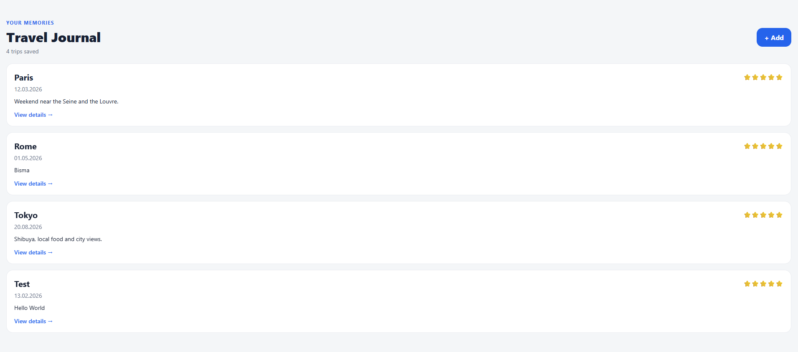
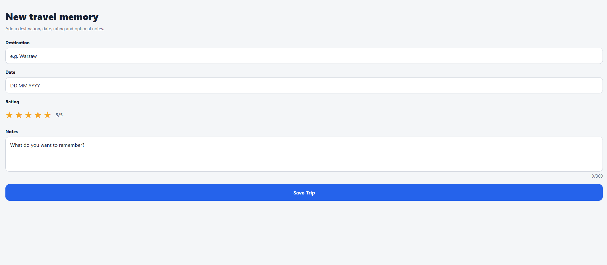
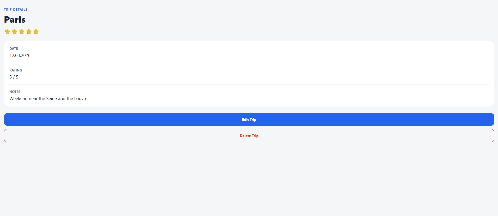

# Travel Journal

Travel Journal is a small React Native / Expo application for saving travel memories. A user can browse saved trips, add a trip with validation, open a details screen, edit an existing trip, and delete an entry. Trips are persisted locally so the journal remains available after restarting the app.

## Main features

- Trip list rendered with `FlatList`
- Add-trip form with validation and user feedback
- Trip details screen using a dynamic Expo Router parameter (`trip/[id]`)
- Edit existing trips
- Delete confirmation
- Global state with React Context API
- Persistent on-device storage with AsyncStorage
- Haptic feedback after save/delete actions
- Stack + Tabs navigation
- Loading and storage-error states
- Responsive Flexbox-based layout
- 17 unit tests covering validation, formatting, and core CRUD business logic

## Tech stack

- React Native
- Expo SDK 54
- TypeScript
- Expo Router
- React Context API
- AsyncStorage
- Expo Haptics
- Jest / jest-expo

## Project structure

```text
app/
  (tabs)/          # Trips and About tabs
  context/         # Shared trip state
  trip/[id].tsx    # Dynamic trip details route
  edit-trip/[id].tsx # Edit existing trip
  add-trip.tsx     # Add trip form
components/        # Reusable UI components
constants/         # Theme values
utils/             # Pure validation/formatting functions
__tests__/         # Validation + CRUD business-logic tests
```

## Setup

Requirements: Node.js LTS and npm.

```bash
npm install
npx expo start -c
```

Then open the project in a compatible Expo Go client or use the web option from Expo for development. The project targets Expo SDK 54.

Run quality checks:

```bash
npm run lint
npm test
```


## Screenshots

Before final submission, add three real screenshots from the running app to `screenshots/` using these exact names:

- `screenshots/home.png` — Trips list
- `screenshots/add-trip.png` — Add Trip form
- `screenshots/details.png` — Trip Details / Edit flow

Then uncomment the Markdown image lines below:

```md



```

Real screenshots are intentionally not fabricated in this repository; they should come from the submitted build.

## Architecture

The project uses Context API because the global state is small and shared by only a few screens. `TripsProvider` owns the trip collection and exposes operations such as `addTrip`, `updateTrip`, `deleteTrip`, and `getTrip`. Form field values remain local `useState` because they are needed only by the add-trip screen.

AsyncStorage is kept behind the Context layer. Screens do not access storage directly, which keeps UI code simpler and makes the data flow easier to explain and maintain.

## Navigation

Expo Router provides file-based navigation. The `(tabs)` group provides Trips and About tabs, while the root Stack opens Add Trip and Trip Details. The details route receives the trip id through the dynamic `trip/[id].tsx` route.

## Native device features

1. **On-device storage:** AsyncStorage persists journal entries locally.
2. **Haptic feedback:** Expo Haptics provides feedback after successful save and delete actions.

## Error handling and security

The form validates required fields, date format, rating range, and input length. Storage operations use `try/catch`, and the UI displays a friendly storage error instead of crashing. The project stores no passwords, tokens, or other sensitive information and does not hardcode API keys.

## Limitations / future work

This version is intentionally small. A future version could add photo selection, cloud synchronization, authentication, maps, or a weather API. Those features are not required for the current architecture and would add additional dependencies and complexity.

## Build

For a preview Android build, configure EAS for the Expo account used to submit the project:

```bash
npx eas-cli init
npx eas-cli build:configure
```

Then create a preview APK with `npx eas-cli build --platform android --profile preview` after signing in and configuring the Expo project. Save the successful build link for the presentation.
